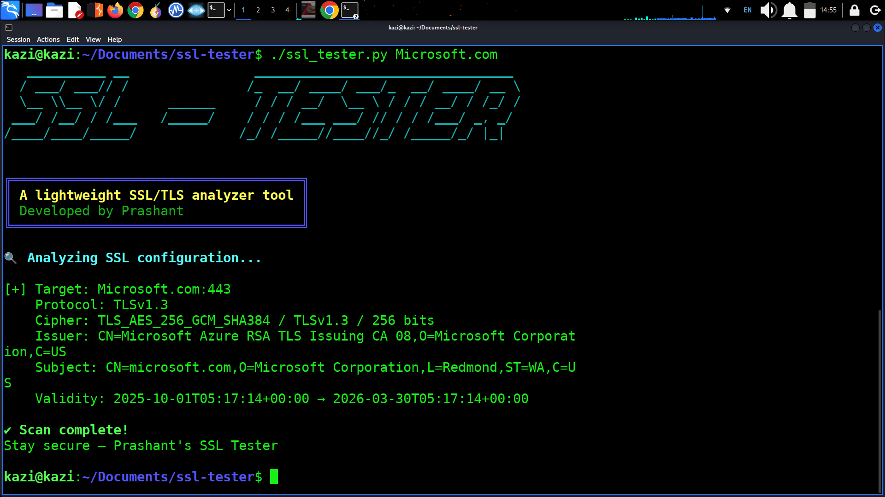

# 🛡️ SSL-Tester

A lightweight command-line SSL/TLS analyzer tool built in Python.  
Check certificates, expiry, protocols, and cipher strength in seconds.

---

## 📸 Tool Preview



---

## ⚙️ Features
- Scan one or multiple domains
- Show certificate validity and expiry days
- Detect protocol and cipher used
- Export JSON reports
- Beautiful color-coded terminal output

---

## 🚀 Usage

```bash
ssl-tester example.com
ssl-tester google.com github.com
ssl-tester --json output.json

